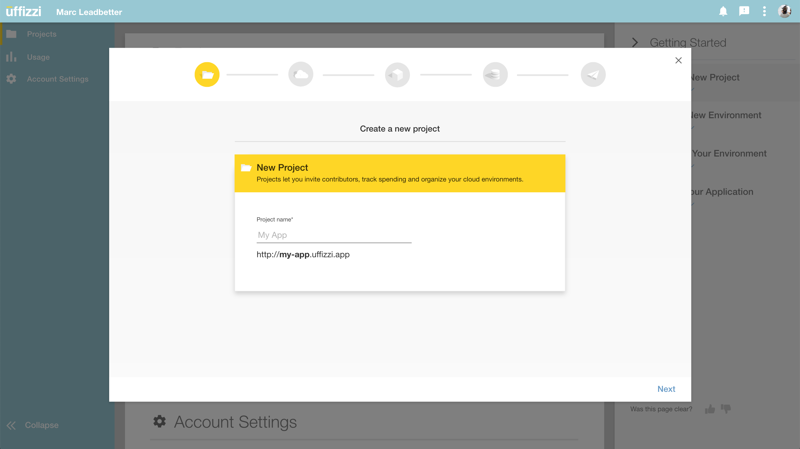
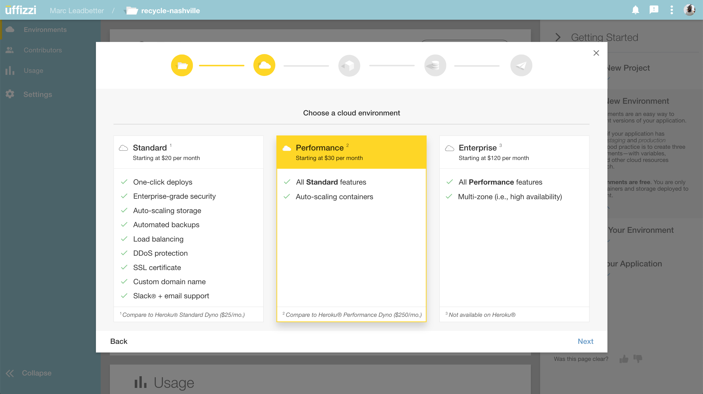
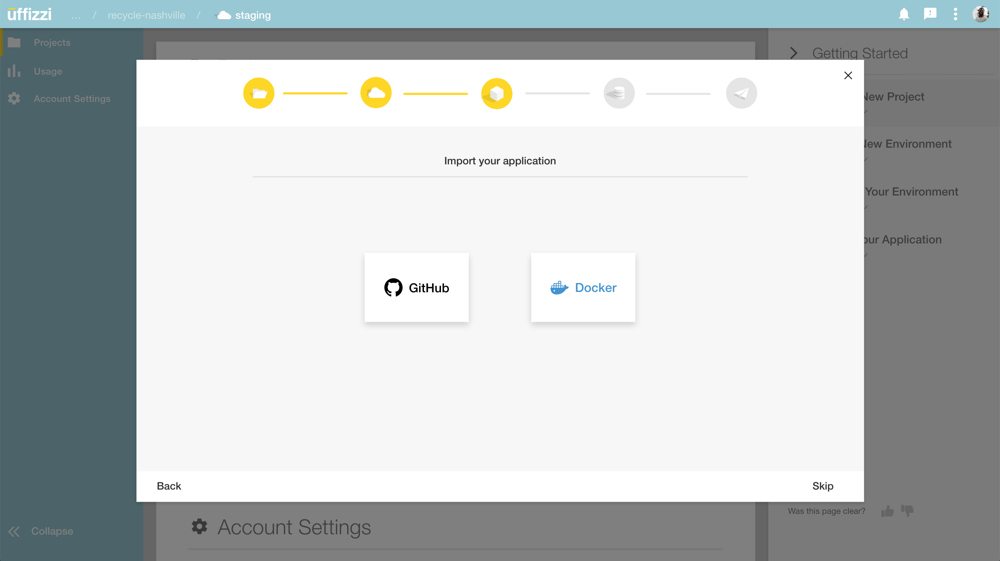
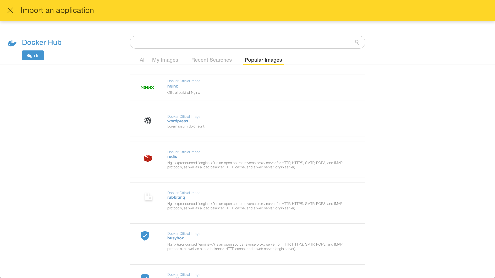
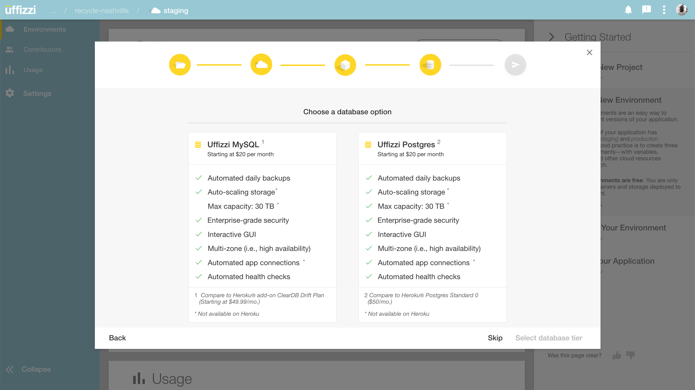
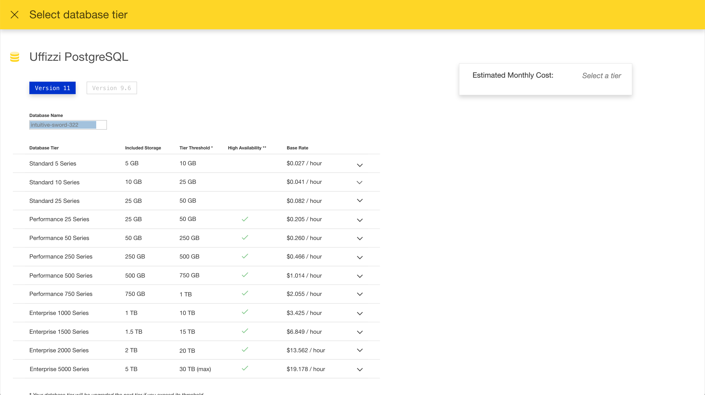
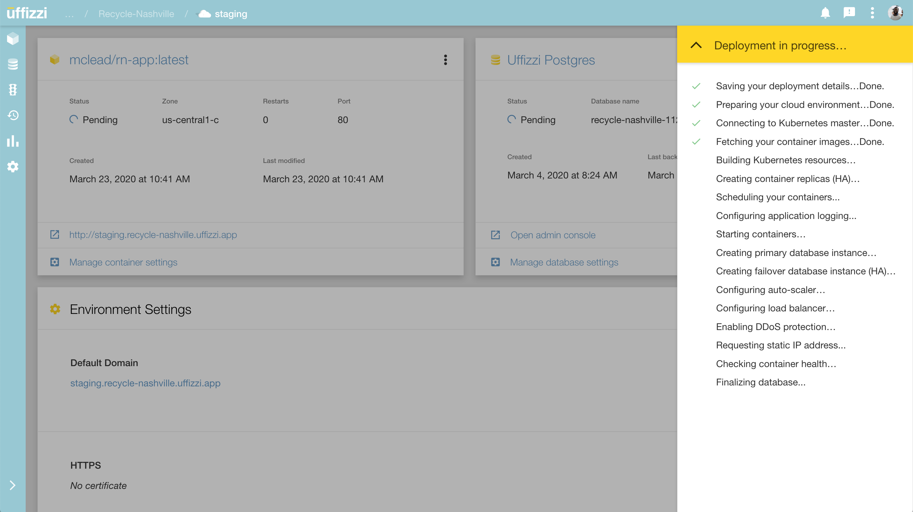

# Uffizzi Cloud
This repository contains basic information about [Uffizzi Cloud](https://uffizzi.cloud).

## About
Uffizzi is a Docker-centric cloud platform that makes it Easy-like-Uffizzi to deploy and manage your applications and databases in the cloud. Deploy APIs, front-ends or full-stack applications direct from Docker Hub, then connect them to one of Uffizzi's fully managed database offerings.

## Why Uffizzi?
Traditional clouds like AWS, Azure and GCP are great if you need a highly customized cloud, but their hundreds of options require time and expertise. Designed to be simple enough for a junior developer but purpose-built for professional applications, Uffizzi automates the complicated setup process typical of other cloud platforms to give you reliable, scalable and secure infrastructure — every time.

## Features
- [x] Deploy from Docker Hub
- [ ] Deploy from GitHub (coming Fall 2020)
- [x] Continuous Deployments from Docker Hub
- [x] Fully managed PostgreSQL
- [x] Fully managed MySQL
- [ ] Fully managed Microsoft SQL Server (coming Fall 2020)
- [x] Automated database backups
- [ ] Object (bucket) storage (coming Fall 2020)
- [x] One-click deploys
- [x] Enterprise-grade security
- [x] Auto-scaling
- [x] Load balancing
- [x] High availability (multi-zonal deployments)
- [x] DDoS protection
- [x] Automated logging
- [x] Free subdomain
- [x] HTTPS encryption (managed SSL certificates)

## FAQs
- [Why would I use Uffizzi?](https://github.com/UffizziCloud/about-uffizzi/blob/master/faqs.md#why-would-i-use-uffizzi)
- [How is Uffizzi different than Heroku?](https://github.com/UffizziCloud/about-uffizzi/blob/master/faqs.md#how-is-uffizzi-different-than-heroku)
- [What are the pre-requisites to be successful on Uffizzi?](https://github.com/UffizziCloud/about-uffizzi/blob/master/faqs.md#what-are-the-pre-requisites-to-be-successful-on-uffizzi)
- [How does Uffizzi work?](https://github.com/UffizziCloud/about-uffizzi/blob/master/faqs.md#how-does-uffizzi-work)
- [What data storage options does Uffizzi offer?](https://github.com/UffizziCloud/about-uffizzi/blob/master/faqs.md#what-data-storage-options-does-uffizzi-offer)
- [Is Uffizzi secure?](https://github.com/UffizziCloud/about-uffizzi/blob/master/faqs.md#is-uffizzi-secure)
- [What is the underlying infrastructure supporting Uffizzi?](https://github.com/UffizziCloud/about-uffizzi/blob/master/faqs.md#what-is-the-underlying-infrastructure-supporting-uffizzi)
- [What languages do you support?](https://github.com/UffizziCloud/about-uffizzi/blob/master/faqs.md#what-languages-do-you-support)
- [How much does it cost?](https://github.com/UffizziCloud/about-uffizzi/blob/master/faqs.md#how-much-does-it-cost)

## Community
Join us on Slack at [Uffizzi Users](https://join.slack.com/t/uffizzi/shared_invite/zt-ffr4o3x0-J~0yVT6qgFV~wmGm19Ux9A).

## Screenshots

